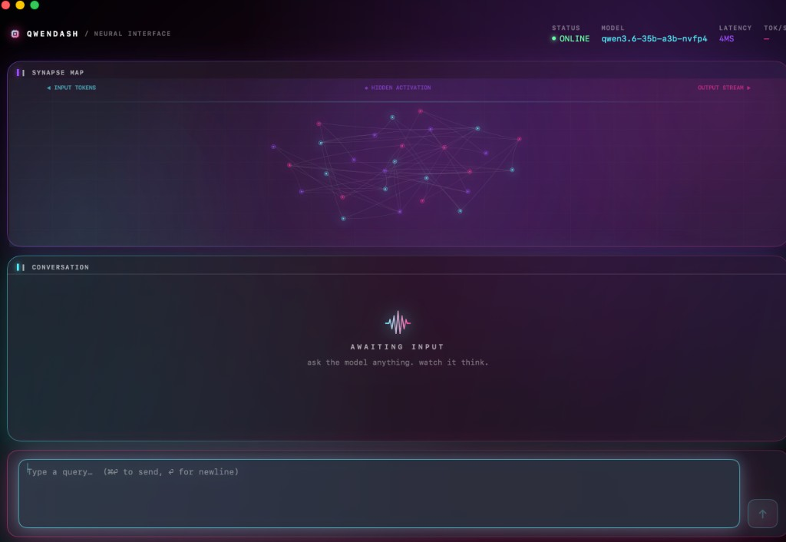

# QwenDash

A native macOS dashboard for talking to a local Qwen model, with a live synapse map that visualises what the model is actually doing as it generates each token.

<p align="center">
  
</p>

## Why this exists

I wanted a nicer face on top of LM Studio than a browser tab, and I wanted the chrome to feel like a real piece of Apple software rather than a web app stuffed into a window. So I built one.

QwenDash is pure SwiftUI. It talks to LM Studio's OpenAI-compatible endpoint over streaming SSE, renders the conversation in a restrained native shell, and plots every generated token on a live graph whose intensity is driven by the model's own output.

## What you get

- **Native SwiftUI app.** System materials, SF Pro typography, a single accent colour, and the kind of corner radii and hairline borders you'd expect from an app shipped by Apple. No Electron, no browser, no 300MB of Chromium.
- **Synapse map — driven by real model output.** Your query tokens appear as nodes on the left. A cluster of hidden nodes sits in the middle, cross-chattering while the model thinks. As the response streams back, each generated token becomes a node on the right, and its brightness is scaled by the probability the model assigned to that token. A confident `"the"` comes in bright; a hedged token where the top-5 candidates all hover around 20% comes in noticeably dimmer. This isn't decorative — the intensity values come straight from `logprobs` data returned by the server.
- **Streaming chat.** Token-by-token output with a proper stop button. Cancel mid-thought, clear the conversation, start over.
- **Live stats bar.** Connection state, loaded model, request latency, tokens/sec, rolling average confidence.
- **Push-to-talk voice, fully on-device.** Tap the mic (or hit ⌥-Space from anywhere on the system) to dictate a question, and the model streams its answer back as speech. Speech-to-text runs locally via WhisperKit; the reply is spoken with a macOS Premium / Enhanced voice, sentence-by-sentence as tokens arrive. Everything after the first-run model download works offline.

## Requirements

- macOS 14 (Sonoma) or newer, Apple Silicon
- Xcode 15 or newer
- [LM Studio](https://lmstudio.ai) running a Qwen model locally

Developed against `mlx-community/Qwen3-*` variants but anything LM Studio exposes via its OpenAI-compatible server should work — the model ID is auto-detected.

## Getting started

### 1. Spin up LM Studio

Open LM Studio, load a model, hop over to the **Developer** tab (the `</>` icon in the left rail), and flip the server toggle **on**. It'll bind to `http://localhost:1234` by default.

Quick sanity check from a terminal:

```bash
curl http://localhost:1234/v1/models
```

If you see your model in the JSON, you're good.

### 2. Run QwenDash

Easiest path is through Xcode:

```bash
git clone https://github.com/rbwet/QwenDash.git
cd QwenDash
open Package.swift
```

That opens the SwiftPM project straight in Xcode. Hit **⌘R** to build and run.

Or from the command line:

```bash
swift run QwenDash
```

Either way, the window comes up, auto-connects to LM Studio, and you can start typing.

## Using it

- Type in the field at the bottom.
- **⌘⏎** to send. Plain `⏎` inserts a newline.
- **⌥-Space** anywhere on the system starts dictation — it brings QwenDash forward and arms the mic. Press again to stop, and the transcribed query gets sent through the normal pipeline. The reply will stream back as speech.
- The mic icon next to the send button does the same thing via click.
- While the model is streaming, the send button flips to a stop icon — click it to abort.
- **Clear** in the top-right of the conversation panel wipes the chat and resets the graph.
- That's basically it. No settings screen, no accounts, no telemetry.

The first time you use voice, WhisperKit will download a small Whisper model (~150 MB for `base`) from HuggingFace into `~/Documents/huggingface/...`. Subsequent launches use the cached model and work completely offline.

## On the synapse map — what's real and what's next

The map is **driven by real data from the model**, not purely decorative. Specifically:

- Every output node's glow and the intensity of its incoming pulse are scaled by the token's probability, parsed from OpenAI-compatible `logprobs` data in each streaming chunk. A probability of 0.95 renders at full brightness; a probability of 0.05 renders dim but visible.
- The confidence percentage in the top bar is the rolling mean of those same probabilities across the current generation.
- Input nodes are derived directly from tokenising your query.

The parts that are still stylised:

- The exact positions of the hidden-cluster nodes and the cross-chatter between them. The cluster's *activity level* responds to real streaming events (each new token kicks a few pulses), but the geometry is a visual metaphor, not a literal projection of any layer's state.
- The specific hidden node that pulses fire from. That's a random pick — the backend doesn't tell us which layer or head was "responsible" for a token, and LM Studio's HTTP API doesn't expose attention weights or expert routing.

**What's next.** The synapse layer is the part I'm least done with. On the roadmap:

- **MoE expert routing.** For Qwen MoE variants, pull the chosen expert IDs per token and drive the hidden cluster with real routing data. That requires running inference directly via MLX Swift instead of going through LM Studio, which is a meaningful project on its own — but when it lands, the map becomes a genuine "which subnetworks fired" display.
- **Attention-proxy visualisation.** Even without ditching LM Studio, the top-*k* alternative tokens at each step (`top_logprobs`) give a real signal about where the model considered branching. Plan is to render ghost alternative-token nodes with opacity scaled by their probability, branching off each output node.
- **Per-token latency colouring.** Colour output nodes by time-to-generate, so slow tokens stand out visually.

None of this is required to use QwenDash today — the current behaviour is complete and honest — but it's where the project is heading.

## What else I want to build

QwenDash is the first piece of a slightly larger idea: a small set of native macOS tools that sit next to what you're already working in, powered by a local model. Two concrete next steps:

- **IDE companion.** A sidebar / floating panel that pairs with Xcode or VS Code, so you can highlight code and ask the local model about it, request rewrites, or run the synapse view against real coding prompts without leaving your editor.
- **Terminal integration.** A thin shim for iTerm2 / Terminal.app that lets you pipe a selection into QwenDash, get a streaming answer back in the same synapse view, and optionally paste the reply back at the cursor. Useful for shell one-liners, git log explanations, or explaining a stack trace.

Both would share the same streaming + logprob pipeline that's already in this repo, so the synapse map comes along for free.

## Source layout

```
QwenDash/
├── Package.swift
├── README.md
└── Sources/QwenDash/
    ├── QwenDashApp.swift         # @main entry, window + activation policy
    ├── ContentView.swift         # overall layout + window backdrop
    ├── Theme.swift               # palette, typography, GlassPanel, PanelLabel
    ├── Models/
    │   ├── ChatMessage.swift
    │   ├── ChatViewModel.swift   # streaming, stats, graph orchestration, voice
    │   ├── LMStudioClient.swift  # OpenAI-compatible SSE + logprob parsing
    │   ├── SynapseGraph.swift    # nodes, edges, pulses, tick()
    │   ├── VoiceSession.swift    # mic capture + WhisperKit + AVSpeechSynthesizer
    │   └── VoiceHotkey.swift     # Carbon-based global hotkey (⌥-Space)
    └── Views/
        ├── StatsBar.swift        # top toolbar: identity + data readouts
        ├── SynapseMapView.swift  # Canvas + TimelineView neural map
        ├── ChatView.swift        # message bubbles, streaming cursor
        └── InputBar.swift        # text field + send button
```

## Tuning

| File | What's in it |
| --- | --- |
| `Theme.swift` | Accent colour, map palette, signal colours, typography, panel style |
| `Models/SynapseGraph.swift` | Hidden cluster size, edge density, pulse speed, output column cap |
| `Views/SynapseMapView.swift` | Node/edge/pulse rendering, grid, curve shape |
| `Models/LMStudioClient.swift` | `baseURL`, temperature, max tokens, whether to request logprobs |
| `ContentView.swift` | Overall layout, window backdrop |

## Troubleshooting

**"Can't reach LM Studio at `localhost:1234`."**
Make sure the server is toggled on in the Developer tab and that a model is actually loaded. A loaded-but-not-served model will not respond.

**The map just sits there.**
It's supposed to. The graph only animates when there's activity — send a message and it'll come alive.

**Confidence stays at `—` during generation.**
The backend isn't returning `logprobs`. Most LM Studio builds support it out of the box; if yours doesn't, set `Config.requestLogprobs = false` in `LMStudioClient.swift` to quiet the stat. Everything else will still work.

**The mic button does nothing / I never got a microphone prompt.**
First tap triggers the Whisper model download, which is silent until it completes (check `~/Documents/huggingface/` for activity). macOS will also prompt for microphone access the first time; deny it once and the prompt won't reappear — go to System Settings → Privacy & Security → Microphone and flip QwenDash (or your terminal, if you launched via `swift run`) back on.

**⌥-Space doesn't trigger dictation.**
The hotkey is a Carbon `RegisterEventHotKey`, not an accessibility monitor, so it shouldn't collide with permission prompts. If something else on your machine has already claimed ⌥-Space (e.g. Spotlight, Alfred, Raycast), that app wins — change the modifier set in `VoiceHotkey.swift`.

**The app launches but I can't type in the input.**
SwiftPM executables can boot as background processes that never become the key window, which quietly swallows every keystroke. The `AppDelegate` already forces `.regular` activation policy on launch, so this shouldn't happen — but if you ever rip the delegate out, that's the bug you'll hit.

**I want a proper `.app` with a Dock icon and a full bundle.**
Create a new Xcode "macOS App" project and drop everything under `Sources/QwenDash/` into it. The source is self-contained, no external dependencies.

## License

MIT. Do whatever you want with it.
